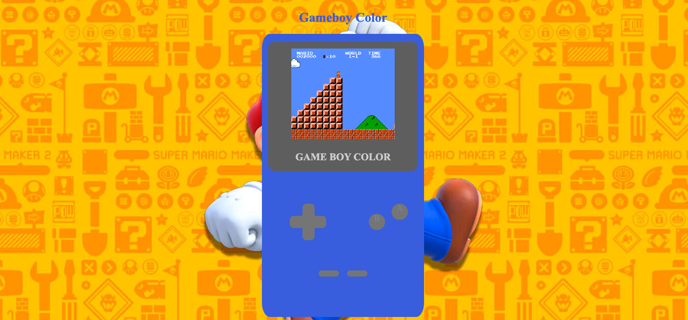
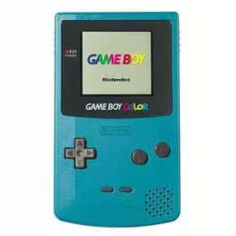

# Videoconsola con CSS

  
Contenido 📝

  <ol>
    <li><a href="#objetivo-🎯">Objetivo</a></li>
    <li><a href="#sobre-el-proyecto-🔎">Sobre el proyecto</a></li>
    <li><a href="#stack">Stack</a></li>
    <li><a href="#vistas">Vistas</a></li>
    <li><a href="#futuras-funcionalidades">Futuras funcionalidades</a></li>
    <li><a href="#contacto">Contacto</a></li>
  </ol>

## Objetivo 🎯
Este proyecto consistía en conseguir reproducir la imagen frontal de nuestra videoconsola portátil favorita, siendo válida cualquier marca y época.

## Sobre el proyecto 🔎
Decidí crear la imagen frontal de una GameBoy Color, con un fondo relacionado con el mismo juego.  
  

## Stack

 

## Vistas
Landing
  
Foto muestra

## Futuras funcionalidades
⬜ Poner luz de power encendido  
⬜ Usar boton de encendido/apagado con animación  
⬜ ...  

## Contacto

